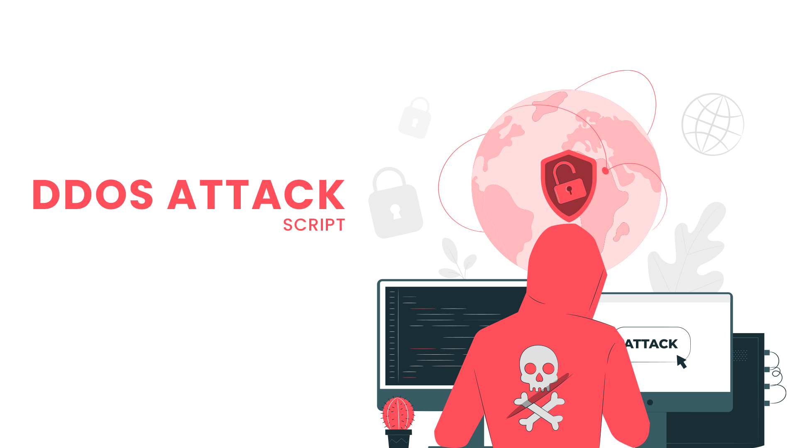

#### #Cybersecurity #Cybersec #Securitytalk #DDOSAttack #Breakinternet

# <b> DDOS-ATTACK

 

### DDoS attacks occur when a cyber-criminal floods a targeted organization's network with access requests; this initially disrupts service by denying legitimate requests from actual customers, and eventually overloads the network until it crashes.

 

### Criminals execute their DDoS attacks by sending out malicious code to hundreds or even thousands of computers, instructing each one to send requests to a single organization. This is usually accomplished through a botnet; a network of private computers infected with malicious software that is controlled as a group, without the knowledge of each individual owner.
 

[` ALWAYS USE THIS SCRIPT ON YOUR RISK (I AM NOT RESPONSIBLE FOR ANYTHING DONE BY YOU)`]

 

# HOW TO RUN THIS SCRIPT ?

## CLONE AND RUN YOUR FIRST ATTACK

- `git clone https://github.com/karthik558/DDoS-ATTACK `
- `cd DDoS-ATTACK`
- `python3 start.py`
- `TYPE IP ADDRESS AND PORT NUMBER`

 USE NSLOOKUP for checking site (IP-ADDRESS) else; use any online IP-ADDRESS finder for getting IP-ADDRESS.

#### STAR THIS REPOSITORY IF YOU LIKE MY WORK ⭐
